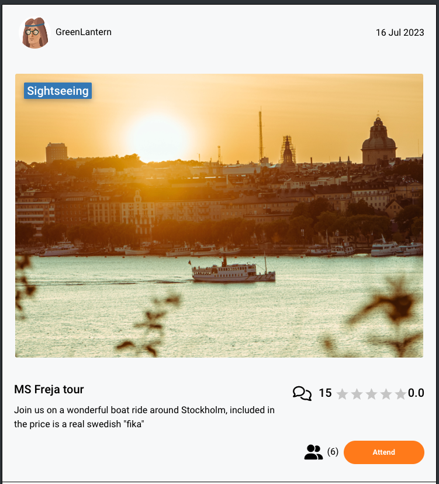
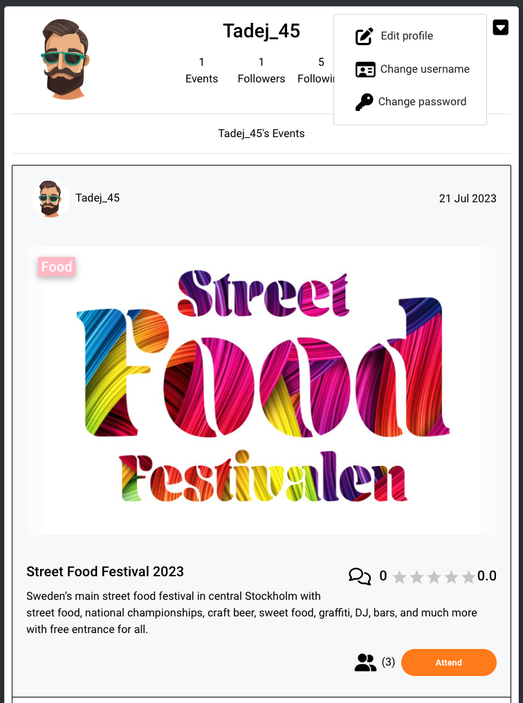
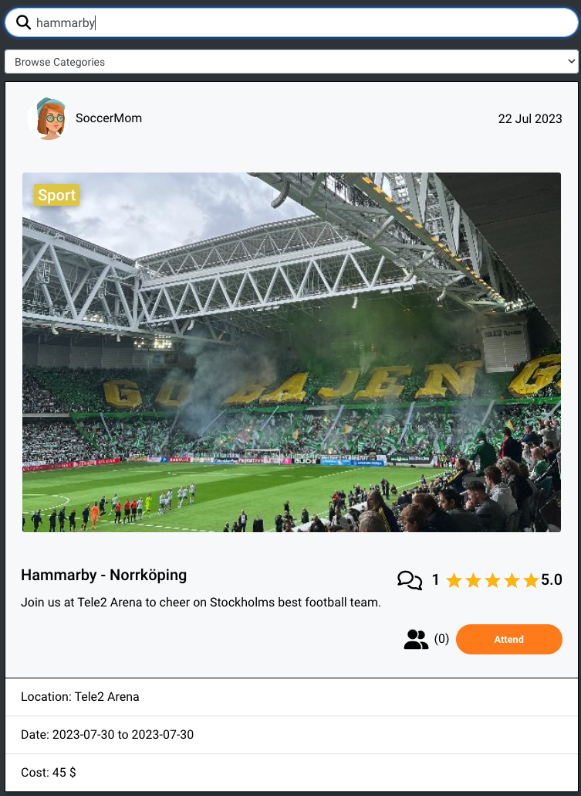

# Milestone project 5 Frontend

  

---
This project has it's own backend API. Here is a link to the repository for [Explore-Sthlm-API](https://github.com/andreas-ka/explore-sthlm-api)

Live website

View live website here: LINK

---

Am i responsive image 

---

## Table of Contents

- [Project Idea and description](#project-idea-and-description)
    - [Project Idea](#project-objective)
    - [Site owner goal](#site-owner-goal)
    - [Site user goal](#site-user-goal)
- [User Stories](#user-stories)
    - [Profile and account management](#profile-and-account-management)
    - [Event](#events)
    - [Rating](#rating)
    - [Comment](#comments)
    - [Navigation and authentication](#navigation-and-authentication)
- [Features](#features)
    - [Navbar](#navbar)
    - [Sign up](#sign-up)
    - [Sign in](#sign-in)
    - [Feed](#feed)
    - [Events Data](#events--homepage)
    - [Event detail](#detailed-event)
    - [Profile](#profiles)
    - [Follow / Followed](#follow---followed)
    - [Comments](#comments)
    - [Calendar](#calendar)
    - [Weather widget](#weather)
    - [Ratings](#ratings-data)
    - [Categories](#categories)
- [Structure](#structure)
    - [Database](#database)
    - [Wireframe](#wireframes)
- [Typography and color scheme](#typography-and-color-scheme)
- [Technologies Used](#technologies-used)
    - [Languages](#languages)
    - [Frameworks](#frameworks)
    - [Database](#database-1)
    - [Tools](#tools)
- [Methodology](#methodology)
    - [Agile Project Management](#agile-project-management-with-github-projects)
    - [User Stories and github](#user-stories-as-github-issues)
    - [### Bug Tracking](#bug-tracking)
    - [### Iterative Development Approach](#iterative-development-approach)
- [Planning & Documentation](#planning--documentation)
    - [Backend](#backend)
    - [Frontend](#frontend)
    - [Reusable Components](#reusable-components)
    - [Testing](#testing)
    - [Documentaion](#documentation--readmemd)
- [Testing](#testing)
- [Programs and tools used](#programs-and-tools-used)
- [Deployment](#deployment)
- [Credits](#credits)

---

### Project idea and description

Explore Sthlm, the website for people living in the capital city of Sweden but also tourists who are here for a visit. Stockholm is renowned for its vibrant cultural scene and dynamic events, and now you can stay connected with all the happenings in one convenient platform.

The website allows users to explore a diverse range of events taking place across the city. From music concerts and art exhibitions to sports tournaments and food festivals, there's always something exciting to discover. With a user-friendly interface and powerful search options, finding events that match your interests has never been easier.

Not only can you explore events, but you can also share and promote your events to a broader audience. Whether organizing a small gathering or a large-scale festival, Explore Sthlm offers a space to showcase your event details and attract attendees.

Engage with fellow event-goers by commenting/reviewing, rating, and sharing your favorite events. Connect with like-minded individuals, share recommendations, and build a vibrant community of event enthusiasts.

---

### Project Objective

The objective of this project and website was the fifth portfolio submission for Code Institutes fullstack developer program. Among following the projects assessment criteria, the website needed to be built using React, JSX (HTML, JavaScript and CSS) and appropriate frameworks and libraries, and connected to a separate backend API. The application needed to have complete CRUD (create, read, update and delete) functionality on the Front-End for users to work with data from an API.

I've chosen to create a project aimed toward my own interests to find inspiration, and chose to create a social networking website targeted towards people who are living or visiting Stockholm.

The project is partly based on the Code Institute Moments course material, using some of the code provided there, with additional functionality and styling added by me.

---

### Site user goal

This website is aimed at primarly two types, the one who wants to share an event, and the other who wants to find something to do. Age is not a factor on website, it's expected visitors would be in the range from 10-70.

People who are planninging an event can share it primariy reach out o alot of people, describe the events detail, like location and cost for example. They can also see what people think of their previous events by the rating and reviews people who attended it have given. They also have a better understanding of how many people that will attend their event due to the attend button that's featured on each event.

The ones who are not planning an event and are here to found one to attend or get inspired can easily navigate the website, click attend on events and later found them in the calendar. Sort events by categorys and easy found out details about each event.

### Site owner goal
As the site owner i thought i would be fun and a great way to see what's happening in my city. Deliver a way for people to reach out easily when they are planning an event. All major sites only contain bigger events, my hopes for this page is to let people share smaller things, your friendly neighborhood flea sale and so on.

---

## User Stories

- These are all the User Storys for this project, they are also found [here](https://github.com/users/andreas-ka/projects/12) on my projects kanban board.

### Profile and account management

- [x] As a registered user i can follow other users so that i can be inspired by likeminded users [#17](https://github.com/andreas-ka/explore-sthlm-react-frontend/issues/17)

- [x] As a registered user i can maintain a profile image so that i can get a personal experience [#16](https://github.com/andreas-ka/explore-sthlm-react-frontend/issues/16)

- [x] As a registered user i can update my profile so that it fits my needs [#4](https://github.com/andreas-ka/explore-sthlm-react-frontend/issues/4)

### Events

- [x] As a registered user i can create my own event so that i can participate on the website [#19](https://github.com/andreas-ka/explore-sthlm-react-frontend/issues/19)

- [ ] As a registered user i can like events so that the creator knows i like it [#11](https://github.com/andreas-ka/explore-sthlm-react-frontend/issues/11).

- [x] As a registered user i can sort events based on categories so that find something specific [#10](https://github.com/andreas-ka/explore-sthlm-react-frontend/issues/10)

- [x] As a registered user i can search all posts/events so that find something particular [#9](https://github.com/andreas-ka/explore-sthlm-react-frontend/issues/9)

- [x] As a registered user i can delete my own event so that i can remove it if it's not relevant anymore [#8](https://github.com/andreas-ka/explore-sthlm-react-frontend/issues/8)

- [x] As a registered user i can update my event so that add or remove information about the event [#7](https://github.com/andreas-ka/explore-sthlm-react-frontend/issues/7)

- [x] As a registered user i can **view details on a specific event ** so that i can get more information [#5](https://github.com/andreas-ka/explore-sthlm-react-frontend/issues/5)    

- [x] As a non registered and registered user i can view the calendar so that i can see the upcoming events. [#5](https://github.com/andreas-ka/explore-sthlm-react-frontend/issues/24)

### Rating

- [x] As a logged in user i can delete my rate on an event so that i can change my opinion about the specific event [#22](https://github.com/andreas-ka/explore-sthlm-react-frontend/issues/22)

- [x] As a logged in user i can edit my rate on an event so that i can change my opinion about the specific event [#21](https://github.com/andreas-ka/explore-sthlm-react-frontend/issues/21)

- [x] As a logged in user i can rate an event so that show my opinion about the specific event [#20](https://github.com/andreas-ka/explore-sthlm-react-frontend/issues/20)

### Comments

- [x] As a registered user i can delete my comment so that if it's not relevant anymore it dont show [#15](https://github.com/andreas-ka/explore-sthlm-react-frontend/issues/15)

- [x] As a registered user i can update my comments so that they have the right information [#14](https://github.com/andreas-ka/explore-sthlm-react-frontend/issues/14)

- [x] As a registered user i can view reviews so that i can participate on the website [#13](https://github.com/andreas-ka/explore-sthlm-react-frontend/issues/13)

- [x] As a registered user i can comments on posts so that i can interact with others and the creator of the post [#12](https://github.com/andreas-ka/explore-sthlm-react-frontend/issues/12)

### Navigation and authentication

- [x] As a registered user i can easily navigate the website so that i can find the information i want [#18](https://github.com/andreas-ka/explore-sthlm-react-frontend/issues/18)

- [x] As a registered user i can view all posts in the feed so that i can get inspired [#6](https://github.com/andreas-ka/explore-sthlm-react-frontend/issues/6)

- [x] As a registered user i can logout so that end my visit at the website [#3](https://github.com/andreas-ka/explore-sthlm-react-frontend/issues/3)

- [x] As a registered user i can login with my credentials so that participate on the website [#2](https://github.com/andreas-ka/explore-sthlm-react-frontend/issues/2)

- [x] As a visiting user i can create an account so that participate in the website [#1](https://github.com/andreas-ka/explore-sthlm-react-frontend/issues/1)

[Back up](#table-of-content)

---

## Features

### Navbar
- Made with bootstrap, collapses on smaller devices. The links change depending on the user state, logged in or logged out.   
Logged in:     
   
Not Logged in:    
   

### Sign up
- Sign up page consists of 3 fields for username, password and confirm password, if username already exist, password to weak or if
passwords dont match you get an alert.    
    

### Sign in
- Same as the sign up page, you get a warning if the provided credentials are not a match.    
     

### Feed
- Feed only shows the posts from the users that you are following.    
Feed page if user not following other users.    
    
Feed page if user follow other users:    
    

### Events / homepage
- Starting page that includes many features, it shows the weather, a search bar and a selector for categories.
The events are all shown in column and uses infinite scroll to load on demand. It also shows statistics for the event, 
how many comments it has, what rating and lets you as a registered user click the attend button to show that you are
attending the event.   
     

### Detailed event
- On the detail page for event can you comment and rate if you are not the owner, the owner can comment and also
edit and delete their event. The event post shows the same features as on the events / homepage.   
    
   
     
    

### Profiles
- Profile page shows statistics for the user, how many events published, following and how many followers. Below the profile
you can see the users events. If you are logged in you can edit your profile shown in the image.    
  

### Follow - Followed
- Is showed on every profile, containing all the statistics for the user.    
  

### Search bar
- Let you search for username and title for the events.    
Searchbar.    
    
Results when searching.    
    
If their are no results in the search.     
  

### Comments
- Comments can be made if you are a registered user, the comment display your profile image, timestamp for when
you did the comment and also the content.    
  

### Calendar
- Made with react-awesome-calendar and shows all the events in different colors depending on the category. The events can be shown in year,
month and day. In the day view, you can click the event and get the detailed view of that event.    
Month view in calendar.    
   
Day view in calendar.    
  

### Weather
- Used react-open-weather to show the current weather in Stockholm, which could be good information when planning your day.    
  

### Ratings data
- Is made with react-star-rating and let's you rate event from 1-5 using stars, on every event you see the average rating for that event.    
  

### Categories
- Used a selector that lets you filter events based on the category.    
Category selector.    
    
Categories displaying in the dropdown.    
  

---

### Structure

### Database

[Back up](#table-of-content)

### Wireframes

#### Homepage.    
    

#### Event detail view.     
     

#### Calendar view.    
     

#### Sign up.     
     

#### Sign in.     
     

#### Profile.     
  

## Typography and color scheme

#### Design Choices

#### Colour

#### Fonts and Typography

[Back up](#table-of-content)

---

## Technologies Used

### Languages

- HTML

- CSS

- Python

- JSX (JavaScript XML)

### Frameworks

- Django: A high-level Python web framework used for building the Recipe Collective website.

- React: A JavaScript library for building user interfaces. It is commonly used for creating dynamic and interactive components in web applications.

- Cloudinary: A cloud-based media management platform used for storing and serving images in the Recipe Collective project.

### Database

- ElephantSQL: ElephantSQL is a PostgreSQL database as a service. It is used as the database for the Recipe Collective project, providing a reliable and scalable storage solution for the application's data.

### Tools

- Git: A distributed version control system tracking project source code changes.

- GitHub: A web-based hosting service for version control repositories for storing and managing the project's source code.

- Gitpod: An online integrated development environment (IDE) used for developing and testing the Recipe Collective project.

- Heroku: A cloud platform that enables deployment and hosting of web applications. Heroku was used for deploying the Recipe Collective project to a live server.

- Balsamiq: A wireframing tool for creating mockups and prototypes of the Recipe Collective website.

- Lucidchart: Lucidchart is a web-based diagramming tool that offers a wide range of diagramming capabilities, including ER diagrams. It provides an intuitive interface and collaboration features, making it suitable for individual and team use.

- Google Fonts: A collection of free and open-source fonts used for typography on the Recipe Collective website.

- Font Awesome: A library of icons used for adding scalable vector icons to the Recipe Collective website.

### Supporting Libraries and Packages

[Back up](#table-of-content)

## Methodology

The Explore Sthlm project has been developed using agile principles, enabling efficient collaboration, iterative development, and effective project management. The following methodology has been employed throughout the project:

### Agile Project Management with GitHub Projects

GitHub Projects has been utilized to facilitate agile project management. User stories and bugs have been organized as GitHub issues, allowing for a clear and structured approach to development. The project board in GitHub Projects serves as a Kanban board, providing an overview of the project's progress.

### User Stories as GitHub Issues

Each user story has been created as a GitHub issue, capturing the desired functionality from the user's perspective. The user stories are linked to their corresponding GitHub issues, allowing easy access to the acceptance criteria, tasks, and comments associated with each user story.

### Bug Tracking 

Bugs encountered during the development process have also been logged as GitHub issues. These issues contain details about the specific bug, its impact, and steps to reproduce it. By linking the bugs in the README.md to their respective GitHub issues, users can gain insights into the bugs' resolution progress and view any additional comments.

### Iterative Development Approach

The Explore Sthlm project follows an iterative development approach, allowing for continuous improvement and progress while adhering to time constraints. The development process is structured into sprints, with each sprint typically lasting around 6 days.

To ensure efficient prioritization, the project employs the MuSCoW (Must have, Should have, Could have, Won't have) method. User stories critical to the app's success are categorized as Must-haves, followed by Should-haves, Could-haves, and Won't-haves. Refer to the [Kanban board]() to view the prioritization.

Within each sprint, a MoSCoW method is used to prioritize user stories further. They are classified as Must Do, Should Do, Could Do, and Won't Do, representing the remaining user stories that will not be included in the sprints. This approach ensures a clear differentiation between the overall project prioritization and the prioritization within each sprint, minimizing any potential confusig & Documentation

### Schedualed to be complete 11th of July 2023

- [x] Plan Sprint (Must do)

- [x] Create and write readme.md (Must do)

- [x] Design Database Schema (Should do)

- [ ] Create the wireframes (Should do)

- [x] Plan Sprint 2 (Must do)

### Completed 10th of July 2023. ✅ 

---

## Backend

### Schedualed to be complete 14th of July 2023

- [x] Create a repository for the api in Github (Must do)

- [x] Start a django project in Gitpod (Must do)

- [x] Install necessary libraries and dependencies (Must do)

- [x] Create an ElephantSQL database and connect it to the API (Must do)

- [x] Connect image uploads to Cloudinary (Must do)

- [x] Add filtering (Should do)

- [x] Deploy the Djano REST API (Should do)

- [x] Plan sprint 3 (Must do)

### Completed 12th July 2023 ✅ 

--- 

## Frontend

### Schedualed to be complete 19th of July 2023

- [x] Create a repository for the Explore Sthlm (Should do)

- [x] Start a React project in Gitpod (Could do)

- [x] Test deploy project on Heroku (Could do)

- [x] Install component library (Could do)

- [x] Design and implement navigation bar (Could do)

- [x] Do so navigation bar and authorization works (Could do)

- [ ] Design and implement footer (Could do)

- [x] Test deploy project on Heroku (Must do)

- [x] Install component library (Must do)

- [x] Design and implement a navigation bar (Must do)

- [x] Do so navigation bar and authorization works (Must do)

- [x] Implement posting events (must do)

### Completed 18th July 2023 ✅ 

### Schedualed to be complete 25th of July 2023

- [x] Add Profile with edit and delete function (must do)

- [x] Implement follow and following on the website (must do)

- [x] Add the comments and rating section for events (must do)

- [x] Find calendar library and implement on site (could do)

- [x] Add weather widget (could do)

- [x] Add the Feed and Top Ratings pages with functionality (must do)

### Completed 23th July 2023 ✅ 

---

## Testing

### Schedualed to be complete 27th of july 2023

- [ ] Test backend

- [ ] Test Frontend

### Completed XXth July 2023 ✅ 

---

## Documentation / README.md

### Schedualed to be complete 28th of july 2023

- [ ] Frontend README.md

- [ ] Backend README.md

### Completed XXth July 2023 ✅ 

[Back up](#table-of-content)

---

## Bugs and issues

All bugs are documented as issues and are best to be seen in the project. [Link Here](https://github.com/users/andreas-ka/projects/12)

[Back up](#table-of-content)

---

## Reusable Components

- Avatar
Used on all events, also used in the navbar. Very handy to just import and add to your 
code instead of writing new code. 

### Steps:

- 1 Create your components folder inside the src folder
- 2 Now create your component js file and add the code, example below:     
      
- 3 Import the component on the page you would like to use it:     
   
- 4 Add the component to your code, voila now it's done!     
  

[Back up](#table-of-content)

---

## Testing

Lighthouse

CSS validator

Eslint

Code validation JSX

To view the manual testing details and results, please [click here](TESTING.md). 

[Back up](#table-of-content)

---

# Programs and tools used

## Software

[React Bootstrap 4.6](https://react-bootstrap-v4.netlify.app/)

[Balsamiq](https://balsamiq.com/)

[Github](https://github.com/)

[Heroku](https://heroku.com/)

[Lighthouse](https://developer.chrome.com/docs/lighthouse/overview/)

[LogoMaker](https://www.logomaker.com/) for logo and favicon.

## Libraries

[React Router dom 5.3](https://reactrouter.com/en/main)

[Eslint](https://eslint.org/)

[Prettier](https://prettier.io/)

[Axios](https://www.npmjs.com/package/axios)

[React-infinite-scroll](https://www.npmjs.com/package/react-infinite-scroll-component)

[react-star-rating](https://www.npmjs.com/package/react-star-ratings)

[react-awesome-calendar](https://www.npmjs.com/package/react-awesome-calendar)

[React Open Weather](https://www.npmjs.com/package/react-open-weather) with OpenWeather API,
i have done research about hiding API key in react and i make a note that using an env file in the frontend
is not really the best option, it leaves it vunerable but after talking to my mentor she said it would be
fine for this project. The Weather API key has 60 calls / minute.

---

## Deployment

### Frontend and Backend 

The website was deployed using Heroku by following these steps:

1. Set DEBUG to False in the settings.py file.
2. Commit and push your code to the GitHub repository.
3. Clear the 'static' folder in Cloudinary to ensure the latest static files are used during deployment. This step is essential to avoid potential conflicts between cached versions of static files and the updated versions being deployed. Clearing the 'static' folder ensures that the latest versions of static files are used during deployment, preventing any errors or inconsistencies.

4. Navigate to the project's deploy page in Heroku.
5. Choose the manual deployment option to deploy the latest code changes. 

#### You can for fork the repository by following these steps:

1. Go to the GitHub repository
2. Click on Fork button in upper right hand corner
3. Wait for the forking process to complete. Once done, you will have a copy of the repository in your GitHub account.

#### You can clone the repository by following these steps: 

1. Go to the GitHub repository
2. Locate the Code button above the list of files and click it
3. Select your preferred method for cloning: HTTPS, SSH, or GitHub CLI, and click the copy button to copy the repository URL to your clipboard.
4. Open Git Bash (or your preferred terminal).
5. Change the current working directory to the location where you want the cloned directory to be created.
6. Type the command **'git clone'** followed by the URL you copied in step 3. The command should look like this: **git clone https://github.com/YOUR-USERNAME/YOUR-REPOSITORY**.
7. Press Enter to create your local clone.

### Linking with the API/backend
- You will need to ensure you have set the axios.defaults.baseURL in the api/axiosDefaults.jsx file to the url of your deployed version of th API. You should then update the CLIENT_ORIGIN config variable in your deployed version of the API to ensure you will be able to make authenticated requests to this API.

[Back up](#table-of-content)

---

## Credits

### Media

- Upload image from [flaticon](https://www.flaticon.com/free-icon/upload_126477)

- No results icon from [veryicon](https://www.veryicon.com/icons/commerce-shopping/jkd_wap/no-result.html)

- Default user profile image from Code Institute.

- Vasa Ship image from [LINK](https://www.vasamuseetsrestaurang.se/fest-pa-museet/)

- Outdoor cinema image from [LINK](https://bigcrowdfactory.com/post/utomhusbio-ralis-2023#:~:text=Sommaren%202023%20kommer%20R%C3%A5lambshovsparken%20eller,som%20du%20inte%20vill%20missa!)

- Street food logo from [LINK](https://www.visitstockholm.com/events/street-food-festival/2023-07-28/)

- Avatars for user from [Freepik](https://img.freepik.com/free-vector/avatars-set-cartoon-style_1284-18338.jpg?size=626&ext=jpg&ga=GA1.1.1776497350.1681300148&semt=sph)

...

### Various tutorials and YouTube channels:

- How to use target="_blank" in react correctly [Link](https://stackoverflow.com/questions/64004975/how-to-add-target-blank-on-react)

- Use sum and reduce [Link](https://www.codingem.com/javascript-calculate-average/)

- How to setups [react-awesome-calendar](https://codesandbox.io/s/mikeham98-react-awesome-calendar-b5reb?file=/src/App.jsx
https://github.com/mikeham98/react-awesome-calendar)

....

[Back up](#table-of-content)

## Acknowledgements
- My awesome wife Sandra, a copywriter by profession, helped me with the Objective text.
- *HUGE* credit to Code Institute and their tutorial on how to build the Moments app, loads of code from that.
- My Mentor @CluelessBiker for awesome support and feedback.
- Tutor Sean for helping sort out the rating_average issue. Mega thanks!

[Back to Top](#top)